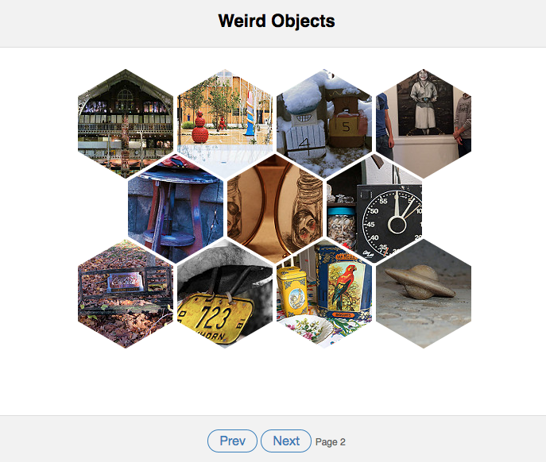

#React Flickr Gallery
This little React application is a photo gallery. the photos are fetched from Flickr API.

## How to install

```bash
$ git clone https://github.com/davelab/ReactFlickrGallery.git
$ cd ReactFlickrGallery && npm install
$ npm start
```

Now, you visit http://localhost:8080/, and should see an hexagonal gallery:



## How to lounch tests
the test suit is written in enzyme and chai running with mocha

```bash
$ npm test
```
## What the application does

> 1. Navigate across pages asynchronously to see different set of weird objects photos
> 2. Enlarge any photo with a modal
> 3. Go to the original Flickr Photo Post
> 4. When the photo is enlarged you can navigate across all the photos in the current page
> 5. Hovering a photo appears the photo owner avatar, clicking you can visit his profile page in flickr
